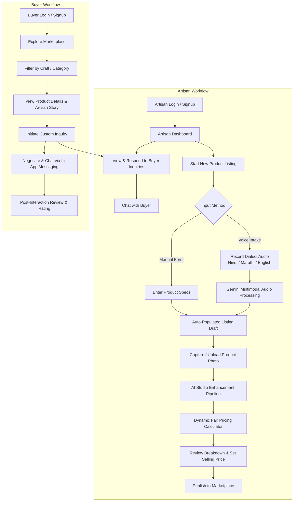
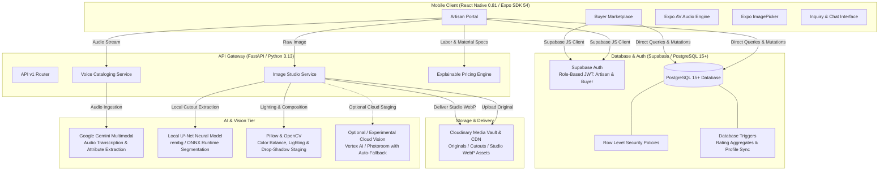
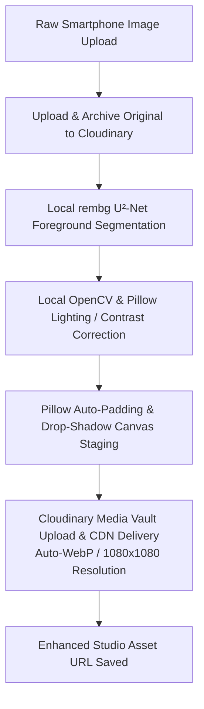

# KalaMitra

> **AI-Powered Digital Business Assistant & Fair-Trade Marketplace for Traditional Indian Artisans**

[](https://fastapi.tiangolo.com)
[](https://www.python.org)
[](https://reactnative.dev)
[](https://expo.dev)
[](https://supabase.com)
[](https://cloudinary.com)
[](https://www.typescriptlang.org)

---

## 📌 Project Overview

Traditional Indian artisans—including handloom weavers, potters, brass casters, woodcarvers, and tribal craftspersons—face significant systemic hurdles when attempting to sell their goods in digital e-commerce marketplaces:

1. **Cataloging & Language Friction:** Creating appealing, structured product descriptions with accurate dimensions, materials, and tags typically requires English proficiency and technical literacy.
2. **Photography & Presentation Gap:** Professional studio photography, soft lighting, and background clean-up tools are inaccessible or cost-prohibitive for rural craft clusters.
3. **Underpricing & Unfair Bargaining:** Without accessible market benchmarks and transparent labor valuation, artisans frequently price products below sustainable cost floors.
4. **Disjointed Buyer-Seller Channels:** Rural artisans lack simple, direct communication channels to negotiate and close custom inquiries with prospective buyers.

**KalaMitra** addresses these challenges through a unified mobile and cloud platform. It enables artisans to speak in their native tongue to generate bilingual e-commerce listings, transform raw smartphone photos into clean studio-grade presentations with zero external photo editing skills, and receive explainable fair-wage pricing recommendations rooted in craft complexity and labor investment.

---

## 🚧 Current Status

> [!IMPORTANT]
> **Active Prototype / MVP Stage**: KalaMitra is an actively developed prototype and Minimum Viable Product (MVP). The current repository contains working end-to-end implementations of the core mobile app, backend services, multimodal AI pipelines, and database layers. It is **not** currently certified for production deployment; ongoing refinement, testing, and feature enhancements are actively underway.

---

## ✨ Key Features

| Feature Area | Implemented Capabilities |
| :--- | :--- |
| **🎙️ Voice Cataloging** | Spoken product description ingestion (Hindi, Marathi, English) converted via Google Gemini multimodal processing (configured with `gemini-3.6-flash`) into structured attributes (title, category, craft technique, materials, dimensions, production time, tags, and bilingual descriptions). |
| **📸 AI Studio Image Enhancement** | Dual-path image transformation pipeline: local neural foreground segmentation (`rembg`/U²-Net), local OpenCV/Pillow lighting and contrast balancing, drop-shadow generation, and Cloudinary media vault storage with auto-WebP delivery. |
| **⚖️ Dynamic Fair Pricing** | Transparent pricing engine calculating a production **Cost Floor** ($\text{Direct Costs} + \text{Overhead} + \text{Minimum Margin}$) merged with **Curated Indian Craft Cluster Benchmarks** (50% market, 40% cost floor, 10% craftsmanship), protecting recommendations against underpricing while preserving full artisan pricing authority. |
| **🏪 Dual-Portal Mobile Experience** | Role-separated application workflows for **Artisans** (inventory management, earnings overview, studio listing creation, voice intake) and **Buyers** (marketplace discovery, category filtering, artisan profiles). |
| **💬 Direct Inquiries & Messaging** | Direct buyer-to-artisan inquiry initiation with custom quantities and requirements, backed by persistent in-app messaging. |
| **⭐ Reviews & Trust System** | Verified buyer ratings and reviews with automated database triggers calculating dynamic artisan aggregate ratings and review counts upon review submissions. |
| **🔐 Secure Multi-Tenant Backend** | Supabase multi-role JWT authentication paired with strict PostgreSQL **Row Level Security (RLS)** ensuring tenant data isolation. |

---

## 🔄 User Workflows & Product Flows



### 1. Artisan Listing & Catalog Creation Flow
1. **Audio Recording**: The artisan speaks naturally about their product in Hindi, Marathi, or English.
2. **AI Extraction**: The backend processes the audio stream with Google Gemini multimodal comprehension (`gemini-3.6-flash`), extracting dimensions, colors, materials, traditional technique, and production duration, while generating titles and descriptions in both English and Hindi.
3. **Studio Staging**: The artisan captures a photo. The image pipeline removes background clutter using local neural segmentation (`rembg`), balances lighting via OpenCV/Pillow, adds subtle drop-shadows, and frames the item on a clean e-commerce background.
4. **Fair Pricing Recommendation**: The engine computes production costs from materials, labor hours, and overhead, compares against curated craft cluster benchmarks, and recommends a fair selling price with a fully explainable breakdown.
5. **Publish**: The product is saved to Supabase PostgreSQL and immediately surfaces in the public marketplace.

### 2. Buyer Discovery & Communication Flow
1. **Browse & Filter**: Buyers discover authentic handcrafted goods filtered by craft type (Handloom, Pottery, Woodcraft, Dhokra, etc.).
2. **Inquiry Generation**: Buyers open an inquiry with requested quantities, delivery timelines, or custom notes.
3. **Direct Chat**: Buyers and artisans communicate directly via the built-in inquiry chat thread.
4. **Review**: Buyers leave verified feedback and 1-5 star ratings for the artisan.

---

## 🏗️ System Architecture



---

## 💻 Technology Stack

| Layer / Subsystem | Technology | Verified Version | Purpose |
| :--- | :--- | :--- | :--- |
| **Mobile Framework** | React Native | `0.81.5` | Cross-platform native mobile application |
| **App Runtime & Tooling** | Expo SDK | `~54.0.36` | Managed mobile workflow and build ecosystem |
| **Mobile Routing** | Expo Router | `~6.0.24` | File-system based type-safe navigation |
| **Language (Mobile)** | TypeScript | `~5.9.2` | Static typing across mobile components |
| **Language (Backend)** | Python | `3.13` | High-performance backend runtime |
| **Backend API** | FastAPI | `>=0.115.0` | Async REST API framework with OpenAPI docs |
| **ASGI Server** | Uvicorn | `>=0.30.0` | Production ASGI web server |
| **Schema Validation** | Pydantic | `>=2.9.0` | Request and response data parsing and validation |
| **Database & Auth** | Supabase / PostgreSQL | `PostgreSQL 15+` | Relational database, user auth, and RLS policies |
| **Database Client** | `@supabase/supabase-js` | `^2.112.4` | Client-side database access and auth state |
| **Multimodal Audio AI** | Google GenAI SDK | `gemini-3.6-flash` | Vernacular audio comprehension and JSON extraction |
| **Local Vision Engine** | `rembg` / ONNX Runtime | U²-Net Model | Zero-cost local background segmentation |
| **Image Processing** | Pillow & OpenCV | Pillow `>=10.0.0` | Lighting correction, padding, and drop-shadow composition |
| **Media Hosting & CDN** | Cloudinary | `>=1.36.0` | Cloud media storage, asset transformations, WebP delivery |

---

## 🖼️ AI & Computer Vision Pipeline

The image enhancement system is structured with a clear separation between media storage, local neural processing, and experimental cloud providers:



### Pipeline Component Breakdown

1. **Ingestion & Vault Storage**:
   - The original image is uploaded and archived in Cloudinary under `artisan-ai/originals/`.
2. **Local Neural Segmentation (Active Primary)**:
   - The product cutout is generated using `rembg` (U²-Net neural network via ONNX Runtime) running locally on the backend. This provides clean background removal with zero external per-image API fees.
   - The resulting transparent PNG is saved to `artisan-ai/cutouts/`.
3. **Local Lighting & Canvas Composition**:
   - Pillow and OpenCV balance dynamic range and adjust brightness.
   - The item is centered on a clean background with realistic soft drop-shadows.
4. **Cloudinary Asset Transformation & CDN Delivery**:
   - Cloudinary acts as the CDN delivery layer, serving the staged image as an optimized, responsive WebP asset under `artisan-ai/enhanced/`. *(Note: Cloudinary handles media delivery and image transformations; foreground segmentation is performed locally).*
5. **Experimental / Secondary Fallback Modules**:
   - The codebase contains experimental modules for Vertex AI / Gemini image editing and Photoroom API staging. These modules are guarded by quota and timeout handlers: if cloud staging is unavailable, the pipeline falls back seamlessly to local processing.

---

## 📊 Explainable Fair-Wage Pricing Engine

The pricing engine implements a deterministic, explainable mathematical model designed specifically for traditional Indian handicrafts. It combines direct production expenses, overhead, a non-negotiable living margin, and curated craft sector benchmarks.

### Mathematical Formulation

#### 1. Production Cost Floor
$$\text{Direct Cost} = \text{Material Cost} + (\text{Production Hours} \times \text{Fair Hourly Wage})$$
$$\text{Overhead} = 10\% \times \text{Direct Cost} \quad \text{(tools, fuel/kiln, wrapping, transport)}$$
$$\text{Total Cost Basis} = \text{Direct Cost} + \text{Overhead}$$
$$\text{Minimum Margin} = 20\% \times \text{Total Cost Basis} \quad \text{(essential artisan livelihood markup)}$$
$$\text{Cost Floor} = \text{Total Cost Basis} + \text{Minimum Margin}$$

#### 2. Craftsmanship Complexity Multiplier
- **Standard Craft**: $0\%$ premium
- **Skilled Handwork**: $+8\%$ value premium
- **Intricate Mastercraft**: $+18\%$ value premium

$$\text{Craft Component} = \text{Cost Floor} \times (1 + \text{Craftsmanship Premium})$$

#### 3. Composite Weighted Recommendation
When benchmark data is available for the craft category:
$$\text{Raw Suggested} = (0.40 \times \text{Cost Floor}) + (0.50 \times \text{Benchmark Median}) + (0.10 \times \text{Craft Component})$$

#### 4. Safety Bounds & Retail Rounding
- **Upper Bound**: $\text{Suggested Price} \le 1.35 \times \text{Benchmark Median}$ (unless the cost floor strictly demands higher).
- **Cost Floor Safety Constraint**: $\text{Suggested Price} \ge \text{Cost Floor}$ (the recommendation is guaranteed never to drop below the minimum sustainable cost floor).
- **Retail Denomination Rounding**: Clean rounding to nearest ₹10 (for $< ₹1000$) or nearest ₹50 (for $\ge ₹1000$), with a strict check preventing rounding from ever dipping below the cost floor.

### Benchmark Data Source
- **Curated Sector Baselines**: Market comparisons are computed against internal curated benchmarks across 8 Indian craft sectors (*Handloom & Textiles, Pottery & Ceramics, Woodcraft, Metalcraft & Dhokra, Bamboo & Cane, Leather Craft, Tribal & Stone, Jewellery & Beads*) derived from craft cluster economic surveys.
- **No Live Scraping**: The current MVP utilizes curated internal benchmark baselines rather than ungrounded web scraping.
- **Artisan Manual Override**: The system presents the complete itemized breakdown to the artisan, who retains full authority to adjust or override the final selling price.

---

## 🗄️ Database Architecture & Access Control

The database schema is designed for PostgreSQL via Supabase and structured across 9 repository SQL migration scripts (`database/migrations/`):

```mermaid
erDiagram
    USERS ||--o| ARTISAN_PROFILES : "extends (1:1)"
    USERS ||--o| BUYER_PROFILES : "extends (1:1)"
    USERS ||--o{ MESSAGES : "sends"
    ARTISAN_PROFILES ||--o{ PRODUCTS : "creates / owns"
    ARTISAN_PROFILES ||--o{ ARTISAN_REVIEWS : "receives"
    BUYER_PROFILES ||--o{ INQUIRIES : "initiates"
    BUYER_PROFILES ||--o{ ARTISAN_REVIEWS : "writes"
    PRODUCTS ||--o{ PRODUCT_IMAGES : "has"
    PRODUCTS ||--o{ PRODUCT_TRANSLATIONS : "has"
    PRODUCTS ||--o{ PRODUCT_TAGS : "has"
    PRODUCTS ||--o{ INQUIRIES : "subject of"
    INQUIRIES ||--o{ MESSAGES : "thread"
    INQUIRIES ||--o| ARTISAN_REVIEWS : "verified via (1:1)"

    USERS {
        uuid id PK
        string email
        string phone
        string role "artisan | buyer"
        timestamp created_at
    }

    ARTISAN_PROFILES {
        uuid id PK_FK
        string shop_name
        string owner_name
        string craft_specialization
        string location
        string language
        string bio
        numeric rating "computed by trigger"
        int rating_count "computed by trigger"
        string avatar_url
        boolean store_verified
        timestamp created_at
    }

    BUYER_PROFILES {
        uuid id PK_FK
        string company_name
        string business_type
        string location
        timestamp created_at
    }

    PRODUCTS {
        uuid id PK
        uuid artisan_id FK
        numeric price "artisan final selling price"
        numeric suggested_price "AI dynamic recommendation"
        jsonb pricing_metadata "cost floor and benchmark metrics"
        string material
        string production_time
        string craft
        int stock
        int min_order_quantity
        boolean is_published "default false"
        timestamp created_at
    }

    PRODUCT_IMAGES {
        uuid id PK
        uuid product_id FK
        string original_url
        string enhanced_url
        boolean is_primary
        timestamp created_at
    }

    PRODUCT_TRANSLATIONS {
        uuid id PK
        uuid product_id FK
        string language "en | hi | mr"
        string name
        string description
        string voice_transcript
        timestamp created_at
    }

    PRODUCT_TAGS {
        uuid id PK
        uuid product_id FK
        string tag_name
    }

    INQUIRIES {
        uuid id PK
        uuid buyer_id FK
        uuid product_id FK
        int quantity
        string expected_delivery
        string status "New | Replied | Closed"
        timestamp created_at
    }

    MESSAGES {
        uuid id PK
        uuid inquiry_id FK
        uuid sender_id FK
        string sender_role "Buyer | Artisan"
        text text
        timestamp created_at
    }

    ARTISAN_REVIEWS {
        uuid id PK
        uuid artisan_id FK
        uuid buyer_id FK
        uuid inquiry_id FK_UQ "1 review per inquiry"
        int rating "1 to 5"
        text review_text
        timestamp created_at
        timestamp updated_at
    }
```

### Row Level Security (RLS) Policies
- **`users`**: Authenticated users can view and edit their own metadata row (`auth.uid() = id`).
- **`artisan_profiles`**: Public `SELECT` for marketplace exploration; `UPDATE` restricted to the profile owner (`auth.uid() = id`). Rating and count fields are protected from client modification and recalculated via database triggers.
- **`buyer_profiles`**: Public `SELECT` for transaction context; `UPDATE` restricted to the profile owner (`auth.uid() = id`).
- **`products`**: Public `SELECT` for published listings (`is_published = true`) or the owning artisan (`auth.uid() = artisan_id`); `INSERT`, `UPDATE`, and `DELETE` restricted strictly to the owning artisan.
- **`product_images`, `product_translations`, `product_tags`**: Public `SELECT`; management (`INSERT`, `UPDATE`, `DELETE`) restricted to the owning artisan via product relational verification.
- **`inquiries`**: `SELECT` and status `UPDATE` restricted to conversation participants (`buyer_id = auth.uid()` or product's `artisan_id = auth.uid()`); `INSERT` restricted to authenticated buyers (`buyer_id = auth.uid()`).
- **`messages`**: `SELECT` and `INSERT` restricted exclusively to participants belonging to the parent inquiry.
- **`artisan_reviews`**: Public `SELECT`; `INSERT` restricted to authenticated buyers with a verified linked inquiry (`inq.buyer_id = auth.uid()` and `inq.id = inquiry_id`), preventing self-rating (`buyer_id <> artisan_id`); `UPDATE` and `DELETE` restricted to the review author.

---

## 🔒 Security Practices

- **Zero Hardcoded Secrets**: All credentials, private tokens, and connection strings are managed strictly via environment variables and excluded from version control.
- **Row Level Security (RLS)**: Enforced directly at the PostgreSQL layer, preventing cross-tenant data leakage even if client queries are tampered with.
- **Database Role vs. Active UI Portal**:
  - **Authoritative Database Role (`users.role`)**: Immutable account role (`'artisan'` or `'buyer'`) stored in PostgreSQL, governing all RLS authorization policies and data ownership.
  - **Client Experience Portal (`activePortal`)**: In-memory navigation state in the mobile application allowing registered artisans to preview the buyer marketplace experience without changing their database role or account security permissions.
- **API Request Validation**: All backend endpoints validate incoming payloads using strict Pydantic v2 schemas to guard against malformed data.
- **CORS Restrictions**: Configurable CORS origins preventing unauthorized cross-origin browser requests.

---

## 📁 Repository Structure

```text
KalaMitra/
├── ai/                             # AI & Computer Vision Subsystems
│   ├── catalog/                    # Catalog generation prompts & schemas
│   ├── pricing/                    # Standalone pricing intelligence scripts
│   ├── vision/                     # Computer vision pipeline
│   │   ├── cloudinary_service.py   # Cloudinary upload & transformation integration
│   │   ├── config.py               # Vision settings & provider configs
│   │   ├── enhancer.py             # Image enhancement orchestration
│   │   ├── fidelity.py             # Preservation & quality validation
│   │   ├── lighting.py             # Lighting & color balance correction
│   │   ├── studio.py               # E-commerce studio composition
│   │   └── tests/                  # Computer vision unit tests
│   └── voice/                      # Voice transcription utilities
├── backend/                        # FastAPI Backend Application
│   ├── app/
│   │   ├── api/v1/                 # API v1 route definitions
│   │   │   ├── image_processing.py # Image processing endpoints
│   │   │   ├── pricing.py          # Pricing recommendation endpoints
│   │   │   ├── products.py         # Product management endpoints
│   │   │   ├── studio.py           # AI studio staging endpoints
│   │   │   ├── voice.py            # Voice-to-catalog endpoints
│   │   │   └── router.py           # Consolidated API router
│   │   ├── core/                   # Core configuration & settings
│   │   ├── pricing/                # Fair pricing engine & category benchmarks
│   │   │   ├── engine.py           # Dynamic pricing calculation core
│   │   │   ├── market_collector.py # Benchmark data collection
│   │   │   └── providers/          # Craft benchmark providers
│   │   ├── schemas/                # Pydantic validation schemas
│   │   └── services/               # Voice, studio, and product services
│   ├── requirements.txt            # Backend Python dependencies
│   └── tests/                      # Backend API & service unit tests
├── database/                       # Database Schemas & Migrations
│   └── migrations/                 # PostgreSQL Supabase migration scripts (01-09)
├── docs/                           # Technical documentation & API specifications
└── mobile/                         # React Native / Expo Mobile Application
    ├── app/                        # Expo Router screen tree
    │   ├── (artisan)/              # Artisan screens (dashboard, catalog, studio, pricing)
    │   ├── (auth)/                 # Authentication screens (login, register, language)
    │   ├── (buyer)/                # Buyer screens (marketplace, product details, store)
    │   ├── chat/                   # Persistent inquiry chat screens
    │   └── _layout.tsx             # Root navigation layout & auth state listener
    ├── assets/                     # Icons, logos, and static media
    ├── components/                 # Reusable UI components & thematic design tokens
    ├── context/                    # React Context providers (Catalog, Creation, Theme)
    ├── services/                   # Supabase & backend HTTP API client services
    └── package.json                # Mobile npm dependencies & scripts
```

---

## 🚀 Getting Started

### Prerequisites

Ensure you have the following installed on your development machine:
- **Node.js** (v18.0 or later) & **npm**
- **Python** (v3.10 to v3.13)
- **Git**
- **Expo Go** app on your physical device or an active iOS Simulator / Android Emulator
- Accounts/Credentials for:
  - [Supabase](https://supabase.com) (PostgreSQL database & Auth)
  - [Cloudinary](https://cloudinary.com) (Media storage)
  - [Google AI Studio](https://aistudio.google.com) (Gemini API Key)

---

### 1. Backend Setup

```bash
# Navigate to repository root
cd DIY-Nest

# Create and activate a Python virtual environment
python3 -m venv venv
source venv/bin/activate   # On Windows: venv\Scripts\activate

# Install backend dependencies
pip install -r backend/requirements.txt
```

Create a `.env` file in the repository root (see [Environment Variables](#-environment-variables)):

```bash
cp .env.example .env
```

Start the FastAPI development server:

```bash
uvicorn backend.app.main:app --reload --port 8000
```

The API will be available at `http://localhost:8000`. Interactive OpenAPI documentation is accessible at `http://localhost:8000/docs`.

---

### 2. Database Migrations Setup

Execute the SQL scripts in `database/migrations/` sequentially within your Supabase SQL Editor:
1. `01_extensions_and_profiles.sql`
2. `02_products_and_metadata.sql`
3. `03_inquiries_and_chat.sql`
4. `04_rls_and_policies.sql`
5. `05_profile_provisioning.sql`
6. `06_product_visibility.sql`
7. `07_dynamic_pricing.sql`
8. `08_buyer_profile_permissions.sql`
9. `09_artisan_reviews.sql`

---

### 3. Mobile App Setup

```bash
# Navigate to mobile directory
cd mobile

# Install mobile dependencies
npm install
```

Create `mobile/.env` (see [Environment Variables](#-environment-variables)):

```bash
cp .env.example .env
```

Start the Expo development server:

```bash
npx expo start
```

- Press `a` for Android Emulator, `i` for iOS Simulator, or scan the QR code with **Expo Go**.
- **Physical Device Note**: Set `EXPO_PUBLIC_API_BASE_URL` in `mobile/.env` to your computer's local network IP (e.g., `http://192.168.1.50:8000`).

---

## 🔑 Environment Variables

> [!WARNING]
> Never commit actual credentials, secret tokens, or private keys to source control.

### Root Backend Environment Variables (`.env`)

| Variable Name | Description |
| :--- | :--- |
| `GEMINI_API_KEY` | Google Gemini API Key for multimodal voice transcription & catalog extraction |
| `CLOUDINARY_CLOUD_NAME` | Cloudinary Cloud Name for media storage |
| `CLOUDINARY_API_KEY` | Cloudinary API Key |
| `CLOUDINARY_API_SECRET` | Cloudinary API Secret |
| `SUPABASE_URL` | Supabase Project URL |
| `SUPABASE_ANON_KEY` | Supabase Anonymous Client Key |
| `CORS_ORIGINS` | Permitted CORS origins (e.g. `*` for local development) |

### Mobile Client Environment Variables (`mobile/.env`)

| Variable Name | Description |
| :--- | :--- |
| `EXPO_PUBLIC_SUPABASE_URL` | Supabase Project URL |
| `EXPO_PUBLIC_SUPABASE_ANON_KEY` | Supabase Anonymous Client Key |
| `EXPO_PUBLIC_API_BASE_URL` | Base URL of the FastAPI backend (e.g. `http://localhost:8000` or local LAN IP) |

---

## 🧪 Development & Testing

### Backend Unit Tests
Execute the backend test suite covering endpoints, pricing engine rules, and voice service handlers:

```bash
# From workspace root with active venv
python3 -m unittest discover backend/tests
```

### Computer Vision Unit Tests
Execute the image pipeline test suite covering background removal, color balancing, and studio staging:

```bash
# From workspace root with active venv
python3 -m unittest discover ai/vision/tests
```

### Mobile Linting & Type Checking
Run ESLint across the React Native TypeScript codebase:

```bash
cd mobile
npm run lint
```

---

## 📸 Screenshots & Product Preview

<!--
Place screenshots in `docs/screenshots/` and link them here.
-->

| Artisan Dashboard | Voice Cataloging | AI Studio Enhancement | Fair Price Breakdown |
| :---: | :---: | :---: | :---: |
| *(Placeholder: Artisan Home & Catalog)* | *(Placeholder: Spoken Audio Intake)* | *(Placeholder: Before & After Studio Staging)* | *(Placeholder: Cost Breakdown & Fair Margin)* |

| Buyer Marketplace | Product Details View | Direct Inquiry Chat | Artisan Profile & Reviews |
| :---: | :---: | :---: | :---: |
| *(Placeholder: Marketplace Browse)* | *(Placeholder: Craft Details & Specs)* | *(Placeholder: In-App Inquiry Chat)* | *(Placeholder: Artisan Story & Ratings)* |

---

## 🗺️ Roadmap & What's Next

- [ ] **Additional Vernacular Languages**: Expand voice cataloging support to Bengali, Tamil, Telugu, Gujarati, and Odia.
- [ ] **Offline-First Synchronization**: Cache draft listings and voice recordings locally via SQLite when artisans are outside cellular coverage, auto-syncing upon reconnection.
- [ ] **ONDC (Open Network for Digital Commerce) Integration**: Enable one-click export of KalaMitra catalog schemas to the ONDC network.
- [ ] **Integrated Order & Logistics Tracking**: Add basic package status updates and localized shipping partner integrations.
- [ ] **Community Storytelling Hub**: Provide artisan micro-documentary video snippets within buyer product listings.

---

## 📚 References & Documentation

- [FastAPI Documentation](https://fastapi.tiangolo.com/)
- [React Native Documentation](https://reactnative.dev/docs/getting-started)
- [Expo Documentation](https://docs.expo.dev/)
- [Google Gemini API Overview](https://ai.google.dev/docs)
- [Supabase Documentation](https://supabase.com/docs)
- [Cloudinary Python SDK Documentation](https://cloudinary.com/documentation/django_image_and_video_upload)
- [U²-Net / rembg Background Removal](https://github.com/danielgatis/rembg)

---

## 📄 License

This project is currently under active development as a prototype. Licensing terms are pending formal declaration. All rights reserved.
