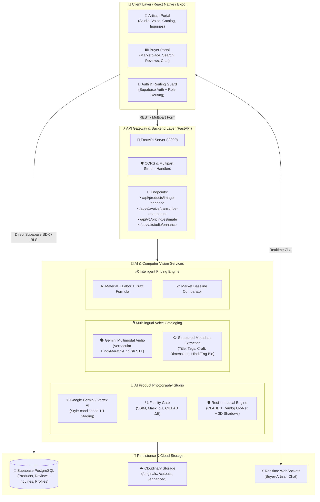
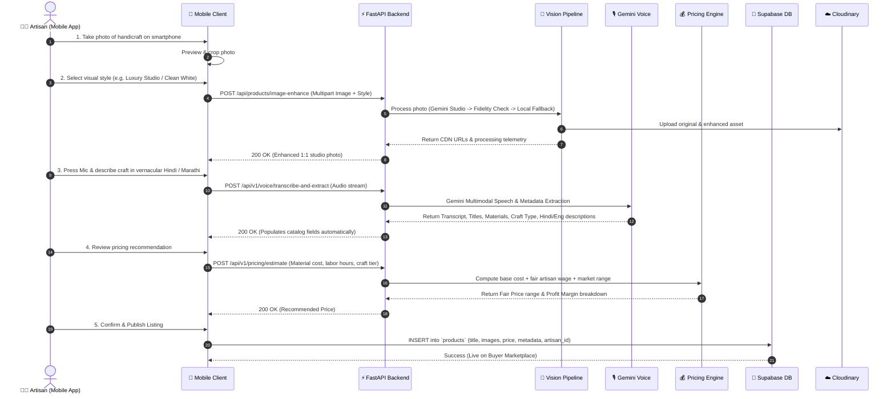
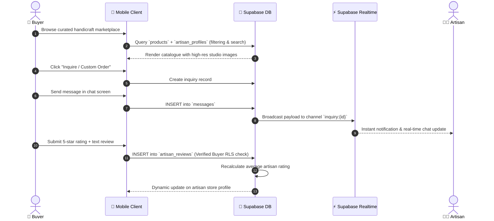

# 🏛️ KalaMitra (कलाMitra) — System Architecture & Workflow Guide

> **Empowering Indian Artisans through AI-Powered E-Commerce Cataloging, Multimodal Studio Enhancement, and Vernacular Commerce.**

---

## 📌 1. Executive Summary & Vision

**KalaMitra** is a specialized mobile-first commerce ecosystem designed to bridge the digital divide for traditional Indian artisans, handloom weavers, and rural craftsmen. 

Artisans face significant barriers in traditional e-commerce:
1. **Low-fidelity product photos** taken on budget smartphones with poor lighting and cluttered backgrounds.
2. **Language and literacy hurdles** when drafting structured, English product listings.
3. **Pricing exploitation and opacity** due to a lack of market awareness.
4. **Direct buyer-to-artisan communication gaps**.

KalaMitra solves these challenges with a unified system combining **React Native (Expo)**, a high-performance **FastAPI backend**, **Google Gemini multimodal AI**, **Local Computer Vision fallback engines**, and **Supabase (PostgreSQL & Realtime)**.

---

## 🏗️ 2. High-Level System Architecture



---

## 🔄 3. End-to-End Core Workflows

### 🎨 Workflow A: The Artisan 5-Step Product Creation Flow



---

### 🛍️ Workflow B: Buyer Discovery, Inquiries, Chat & Reviews



---

## 🧩 4. Detailed Component Breakdown

### 4.1 Mobile Application (`/mobile`)
* **Framework**: React Native with **Expo Router** (File-based navigation).
* **Architecture**: Dual-Portal system:
  * `(artisan)/`: Dashboard, AI Studio wizard, Voice cataloging, Inventory, Inquiries, Analytics.
  * `(buyer)/`: Marketplace, Category filters, Seller store profiles, Realtime inquiries, Reviews.
  * `(auth)/`: Unified email & phone authentication with role-based routing guards.
* **Network Client**: Resilient `api.ts` HTTP client with automatic IP resolution, robust FormData streaming, and error normalization.

### 4.2 API Backend Layer (`/backend`)
* **Framework**: **FastAPI** (Python 3.11 asynchronous server with Uvicorn).
* **Key Routers**:
  * `/api/products/image-enhance`: Primary studio enhancement gateway with automatic fallback management.
  * `/api/v1/voice/transcribe-and-extract`: Accepts audio bytes (M4A/WAV/MP3) and outputs structured bilingual listings.
  * `/api/v1/pricing/estimate`: Rule-based and market-calibrated fair price calculation.
  * `/api/v1/studio/enhance`: Standalone computer vision studio staging.

### 4.3 AI Vision & Studio Pipeline (`/ai/vision`)
A resilient, dual-layer computer vision pipeline:
1. **Primary Layer (Cloud AI)**:
   * Google Gemini / Vertex AI model (`gemini-2.5-flash-image` / `gemini-3.1-flash-image`).
   * Applies prompt-based studio lighting, contextual backdrops, and photorealistic rendering.
2. **Product Fidelity Validation Gate**:
   * Evaluates Structural Similarity Index (**SSIM**), Mask **IoU**, and **CIELAB Delta E** to guarantee the artisan's handmade product is not hallucinated or altered.
3. **Resilient Local Fallback Engine** (100% offline-capable):
   * **EXIF Normalization**: `Pillow` orientation handling.
   * **Lighting Correction**: `OpenCV` Gray-World white balancing + **CLAHE** adaptive histogram equalization.
   * **Super-Resolution**: Lanczos-4 & Bilateral unsharp filtering.
   * **Background Isolation**: **U2-Net** salient segmentation via `rembg`.
   * **Studio Composition**: Procedural gradient backdrop + realistic perspective drop shadows.

### 4.4 Multimodal Voice Cataloging (`/ai/voice` & `backend/app/services/voice_service.py`)
* **Direct Audio Understanding**: Bypasses traditional fragile two-stage STT $\to$ LLM by passing audio bytes directly to Gemini Multimodal Developer API.
* **Vernacular Language Support**: Automatically detects and processes spoken Hindi, Marathi, Gujarati, Tamil, Telugu, and Indian English.
* **Structured Information Extraction**: Produces e-commerce titles, material compositions, craft categories, estimated production days, dimensions, tags, and bilingual descriptions.

### 4.5 Data & Security Layer (`/database`)
* **Database**: **Supabase (PostgreSQL 15)**.
* **Security & RLS**: Strict Row-Level Security policies enforcing:
  * Public read access for published marketplace products.
  * Private CRUD access for artisans on their own catalog.
  * Verified buyer authorization for inquiry messages and review submissions.
* **Realtime Engine**: PostgreSQL Change Data Capture (CDC) streaming over WebSockets for instant messaging.

---

## 📊 5. Technology Stack Summary

| Layer | Technology | Key Responsibility |
| :--- | :--- | :--- |
| **Mobile Frontend** | React Native, Expo 51, TypeScript | Cross-platform Artisan & Buyer UX |
| **Backend API** | FastAPI, Uvicorn, Pydantic v2 | High-throughput async API Gateway |
| **Generative Vision AI** | Google Gemini / Vertex AI | Studio background generation & staging |
| **Local Vision Engine** | OpenCV, Pillow, Rembg (U2-Net), NumPy | Resilient deterministic offline fallback |
| **Speech & NLU** | Google GenAI SDK (`vertexai=False`) | Multilingual speech-to-catalog generation |
| **Database & Auth** | Supabase (PostgreSQL, GoTrue Auth) | Identity, relational storage & RLS security |
| **Asset Persistence** | Cloudinary CDN Vault | Global image hosting, transformations & CDN |
| **Realtime Chat** | Supabase Realtime (WebSockets) | Instant buyer-artisan communication |

---

## 🚀 6. How to Run Locally

### 1. Start the FastAPI Backend
```powershell
# From project root
python -m uvicorn backend.app.main:app --host 0.0.0.0 --port 8000 --reload
```

### 2. Start the Expo Mobile App
```powershell
# From mobile/ directory
cd mobile
npx expo start -c
```
* Scan the displayed QR code with the **Expo Go** app on Android or iOS.
