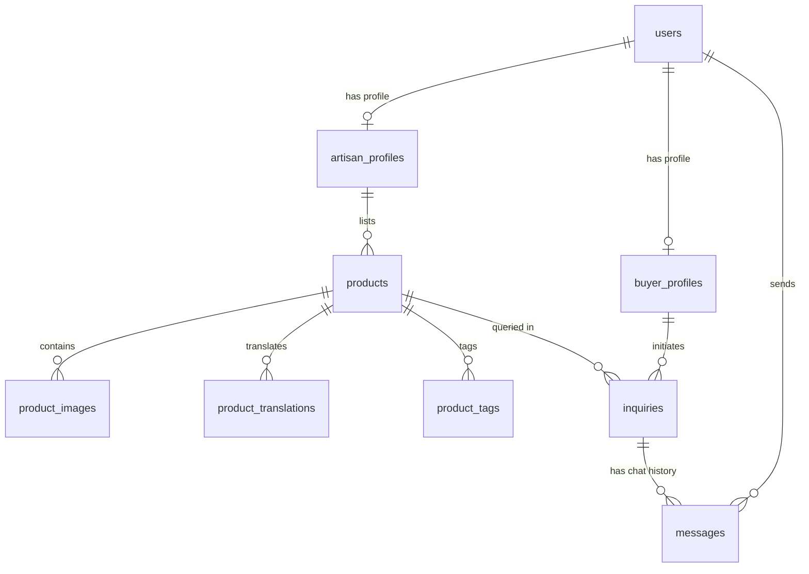

# KalaMitra Relational Database Schema Design

This document details the production database schema designed for KalaMitra (कलाMitra) built on Supabase (PostgreSQL), specifying Row-Level Security (RLS) policies, indexes, storage buckets, and foreign key rules.

---

## 1. Entity Relationship Diagram

---

## 2. Table Specifications

### users
* **Purpose**: Primary identity mapping matching Supabase `auth.users`.
* **Primary Key**: `id` `uuid` references `auth.users(id)` ON DELETE CASCADE.
* **Columns**:
  * `email` `text` (nullable, matches sign-in metadata)
  * `phone` `text` (nullable)
  * `role` `varchar(20)` NOT NULL CHECK (`role` IN ('artisan', 'buyer'))
  * `created_at` `timestamp with time zone` DEFAULT `timezone('utc'::text, now())` NOT NULL
* **RLS**: Users can select/update only their own rows.

### artisan_profiles
* **Purpose**: Custom profile details for artisan stores.
* **Primary Key**: `id` `uuid` references `users(id)` ON DELETE CASCADE.
* **Columns**:
  * `shop_name` `text` NOT NULL
  * `owner_name` `text` NOT NULL
  * `craft_specialization` `text`
  * `location` `text`
  * `language` `varchar(10)` DEFAULT 'Hindi' NOT NULL
  * `bio` `text`
  * `rating` `numeric(3,2)` DEFAULT 5.00 NOT NULL
  * `avatar_url` `text`
  * `store_verified` `boolean` DEFAULT false NOT NULL
  * `created_at` `timestamp with time zone` DEFAULT `timezone('utc'::text, now())` NOT NULL
* **RLS**: Public read, write updates restricted to owner artisan. Profile creation is strictly server-controlled via FastAPI backend using Supabase service-role context (no client-side INSERT allowed).

### buyer_profiles
* **Purpose**: Custom profile details for wholesale buyers.
* **Primary Key**: `id` `uuid` references `users(id)` ON DELETE CASCADE.
* **Columns**:
  * `company_name` `text`
  * `business_type` `text`
  * `location` `text`
  * `created_at` `timestamp with time zone` DEFAULT `timezone('utc'::text, now())` NOT NULL
* **RLS**: Public read, write updates restricted to owner buyer. Profile creation is strictly server-controlled via FastAPI backend using Supabase service-role context (no client-side INSERT allowed).

### products
* **Purpose**: Catalog listings.
* **Primary Key**: `id` `uuid` DEFAULT `gen_random_uuid()` NOT NULL.
* **Foreign Keys**:
  * `artisan_id` `uuid` references `artisan_profiles(id)` ON DELETE CASCADE NOT NULL.
* **Columns**:
  * `price` `numeric(10,2)` NOT NULL
  * `material` `text`
  * `production_time` `text`
  * `craft` `text`
  * `stock` `integer` DEFAULT 1 NOT NULL
  * `min_order_quantity` `integer` DEFAULT 1 NOT NULL
  * `created_at` `timestamp with time zone` DEFAULT `timezone('utc'::text, now())` NOT NULL
* **RLS**: Public read, write restricted to the listing artisan.
* **Indexes**: Index on `artisan_id`, index on `price`.

### product_images
* **Purpose**: Images associated with product listings (original and background-removed).
* **Primary Key**: `id` `uuid` DEFAULT `gen_random_uuid()` NOT NULL.
* **Foreign Keys**:
  * `product_id` `uuid` references `products(id)` ON DELETE CASCADE NOT NULL.
* **Columns**:
  * `original_url` `text` NOT NULL
  * `enhanced_url` `text`
  * `is_primary` `boolean` DEFAULT true NOT NULL
  * `created_at` `timestamp with time zone` DEFAULT `timezone('utc'::text, now())` NOT NULL
* **RLS**: Public read, write restricted to product listing artisan.

### product_translations
* **Purpose**: Translating title, description, and transcripts into multiple languages.
* **Primary Key**: `id` `uuid` DEFAULT `gen_random_uuid()` NOT NULL.
* **Foreign Keys**:
  * `product_id` `uuid` references `products(id)` ON DELETE CASCADE NOT NULL.
* **Columns**:
  * `language` `varchar(10)` NOT NULL (Intentionally general to support any Indian languages, e.g. 'en', 'hi', 'mr')
  * `name` `text` NOT NULL
  * `description` `text`
  * `voice_transcript` `text`
  * `created_at` `timestamp with time zone` DEFAULT `timezone('utc'::text, now())` NOT NULL
* **Constraints**: Unique constraint on `(product_id, language)`.
* **RLS**: Public read, write restricted to product listing artisan.

### product_tags
* **Purpose**: Keyword tags for indexing and text filtering.
* **Primary Key**: `id` `uuid` DEFAULT `gen_random_uuid()` NOT NULL.
* **Foreign Keys**:
  * `product_id` `uuid` references `products(id)` ON DELETE CASCADE NOT NULL.
* **Columns**:
  * `tag_name` `varchar(50)` NOT NULL
* **RLS**: Public read, write restricted to product listing artisan.
* **Indexes**: B-Tree index on `tag_name` for fast matching.

### inquiries
* **Purpose**: Wholesale inquiry proposals.
* **Primary Key**: `id` `uuid` DEFAULT `gen_random_uuid()` NOT NULL.
* **Foreign Keys**:
  * `buyer_id` `uuid` references `buyer_profiles(id)` ON DELETE SET NULL (nullable).
  * `product_id` `uuid` references `products(id)` ON DELETE SET NULL (nullable).
* **Columns**:
  * `quantity` `integer` NOT NULL
  * `expected_delivery` `text`
  * `status` `varchar(20)` DEFAULT 'New' NOT NULL CHECK (`status` IN ('New', 'Replied', 'Closed'))
  * `created_at` `timestamp with time zone` DEFAULT `timezone('utc'::text, now())` NOT NULL
* **RLS**: Restricted to the buyer who created the inquiry and the artisan who owns the listing.

### messages
* **Purpose**: Messages inside inquiries.
* **Primary Key**: `id` `uuid` DEFAULT `gen_random_uuid()` NOT NULL.
* **Foreign Keys**:
  * `inquiry_id` `uuid` references `inquiries(id)` ON DELETE CASCADE NOT NULL.
  * `sender_id` `uuid` references `users(id)` ON DELETE SET NULL (nullable).
* **Columns**:
  * `sender_role` `varchar(20)` NOT NULL CHECK (`sender_role` IN ('Buyer', 'Artisan'))
  * `text` `text` NOT NULL
  * `created_at` `timestamp with time zone` DEFAULT `timezone('utc'::text, now())` NOT NULL
* **RLS**: Restricted to participants (the initiating buyer or the listing artisan).
* **Indexes**: Composite index on `(inquiry_id, created_at)` for fast chronological logs loading.

---

## 3. Storage Strategy

We will utilize Supabase Storage (or Cloudinary integration via webhook) for media hosting:

* **`product-images` bucket**:
  * Public read access to bucket assets.
  * Write policy: Artisan can upload to the bucket under a structured path `/products/artisan-uuid/image-uuid.jpg`.

---

## 4. Database Role Access Privileges (Least Privilege)

To restrict direct Data API queries in Supabase (which has "Automatically expose new tables" disabled), all default public schema privileges on all tables are explicitly revoked from `anon` and `authenticated` roles. Custom least-privilege operations are then explicitly granted:

### anon (Anonymous Guest)
* **SELECT**: `artisan_profiles`, `buyer_profiles`, `products`, `product_images`, `product_translations`, `product_tags`
* **INSERT/UPDATE/DELETE**: None (disabled)

### authenticated (Registered App Users)
* **SELECT / UPDATE**: `users`, `artisan_profiles`, `buyer_profiles` (R/W updates restricted to owner profiles)
* **SELECT / INSERT / UPDATE / DELETE**: `products`, `product_images`, `product_translations`, `product_tags` (R/W updates restricted to owning artisan)
* **SELECT / INSERT**: `inquiries` (R/W updates limited to `status` and `expected_delivery` fields only; reassigning `buyer_id` and `product_id` is blocked)
* **SELECT / INSERT**: `messages`

### service_role (Trusted Server APIs)
* **ALL**: Complete administrative grants on all public tables (bypassing RLS policies for server operations)
