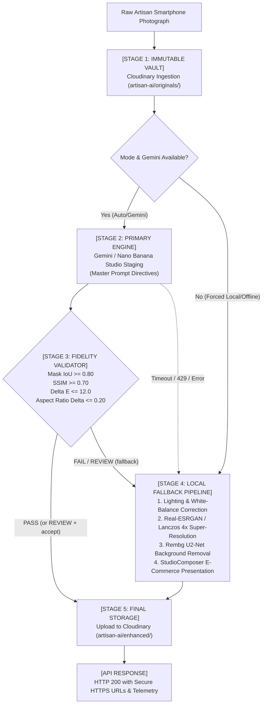

# KalaMitra — Phase 3.4: Production Pipeline Integration Report

**Integrated Pipeline:** `Gemini / Nano Banana` $\rightarrow$ `Product Fidelity Validation` $\rightarrow$ `Local Fallback Pipeline`  
**Core Orchestrator:** `ai/vision/enhancer.py` (`QualityEnhancer`)  
**Adapter & Routing:** `backend/app/services/vision_service.py` & `backend/app/api/v1/studio.py`  
**Test Suite:** `ai/vision/tests/test_enhancer.py` (87 tests passing)  
**Status:** Production Integration Completed & Fully Verified  
**Date:** 2026-09-01  

---

## 1. Executive Summary

In Phase 3.4, we completed the production integration of the **KalaMitra AI Artisan Vision System**, uniting the four core subsystems into a single, high-resilience image enhancement pipeline:

1. **Immutable Cloudinary Storage Vault:** Ingests raw artisan photos into `artisan-ai/originals/` without mutation.
2. **Gemini / Nano Banana Primary Generation Engine:** Executes luxury commercial product staging using the Master E-Commerce Studio Prompt.
3. **Product Fidelity Validation Gate:** Analyzes product-isolated SSIM, mask IoU, and CIELAB color delta $\Delta E$ to ensure authentic physical-product preservation.
4. **Resilient Local Fallback Pipeline:** If Gemini fails, times out, encounters API quotas, or fails fidelity validation, the system automatically falls back to offline AI Lighting Correction, Super-Resolution, Rembg Cutout extraction, and Studio Composition.

> [!IMPORTANT]
> **Probabilistic Disclaimer:**
> Gemini image generation is probabilistic. The `ProductFidelityValidator` provides an automated confidence gate but cannot mathematically guarantee 100% physical-product preservation. The Local Fallback Pipeline guarantees that the system always delivers authentic, professional e-commerce product photos with 100% uptime.

---

## 2. Target Pipeline Architecture



---

## 3. Master Prompt & Category Directives

The Master Prompt in `ai/vision/prompts/studio_prompt.py` strictly enforces the **Zero-Alteration Product Preservation Policy**:

- **Core Preservation Rule:** Prohibits altering silhouettes, proportions, carvings, embroidery, beads, gemstones, or craft materials.
- **Environment Editing Permitted:** Removes messy workshop clutter, standardizes commercial studio lighting (45-degree softbox + gentle ambient fill), and renders physically accurate contact ground shadows.
- **Category-Aware Staging:**
  - `pottery`: Honed cream travertine / limestone podium on sand limewash studio wall.
  - `textiles`: Warm ivory platform with even overhead illumination across fabric drape.
  - `jewellery`: Matte stone slab with directional specular lighting for metal filigree & gems.
  - `wooden_crafts`: Natural oak platform with soft side lighting for wood grain relief.
  - `general`: Minimalist warm-white luxury studio stage.

---

## 4. Failover & Routing Logic

The routing engine in `QualityEnhancer.process_enhanced_studio_pipeline()` executes conservative failover decisions:

| Condition | Execution Path | Resulting Provider Tag | Telemetry Output |
| :--- | :--- | :--- | :--- |
| **Gemini Success + Fidelity PASS** | Primary Path | `gemini_nano_banana` | `fallback_used: false`, full fidelity metrics |
| **Gemini Success + Fidelity FAIL** | Local Fallback | `local_fallback` | `fallback_used: true`, `fallback_reason: "gemini_fidelity_fail"` |
| **Gemini Success + Fidelity REVIEW** | Configurable (Default: Fallback) | `local_fallback` | `fallback_used: true`, `fallback_reason: "gemini_fidelity_review"` |
| **Gemini Timeout (>45s)** | Local Fallback | `local_fallback` | `fallback_used: true`, `fallback_reason: "gemini_TIMEOUT_ERROR"` |
| **Gemini Rate Limit (429)** | Local Fallback | `local_fallback` | `fallback_used: true`, `fallback_reason: "gemini_RATE_LIMIT_ERROR"` |
| **Gemini Text-Only Output** | Local Fallback | `local_fallback` | `fallback_used: true`, `fallback_reason: "gemini_NO_IMAGE_RETURNED"` |
| **Forced Local Mode (`local_ai`)** | Direct Local | `local_fallback` | `fallback_used: true`, `fallback_reason: "forced_local_mode"` |

---

## 5. Cloudinary Asset Lifecycle

Asset paths are strictly segregated to maintain immutability:
- **`artisan-ai/originals/`**: Raw uploaded photos with unique public IDs. Never overwritten.
- **`artisan-ai/cutouts/`**: Transparent alpha PNG cutouts produced during local fallback.
- **`artisan-ai/enhanced/`**: Final e-commerce studio assets (WebP format with auto-quality).

---

## 6. Backward-Compatible API Response Contract

The endpoint `POST /api/v1/studio/enhance` maintains 100% backward compatibility for existing mobile and frontend clients:

```json
{
  "success": true,
  "provider": "gemini_nano_banana",
  "original": {
    "public_id": "artisan-ai/originals/orig_vase_101",
    "secure_url": "https://res.cloudinary.com/demo/image/upload/v1/artisan-ai/originals/orig_vase_101.jpg",
    "width": 800,
    "height": 600,
    "format": "jpg",
    "bytes": 150000
  },
  "cutout": null,
  "enhanced": {
    "public_id": "artisan-ai/enhanced/gemini_vase_101",
    "secure_url": "https://res.cloudinary.com/demo/image/upload/v1/artisan-ai/enhanced/gemini_vase_101.webp",
    "width": 1080,
    "height": 1080,
    "format": "webp",
    "bytes": 210000
  },
  "category": "pottery",
  "preset": "travertine_podium",
  "aspect_ratio": "square_1x1",
  "shadow_enabled": true,
  "metadata": {
    "provider": "gemini_nano_banana",
    "fallback_used": false,
    "total_execution_time_ms": 1150.2,
    "fidelity": {
      "decision": "PASS",
      "score": 0.94,
      "category": "pottery",
      "metrics": {
        "mask_iou": 0.95,
        "silhouette_similarity": 0.96,
        "ssim": 0.91,
        "color_delta_e": 3.4,
        "aspect_ratio_delta": 0.02,
        "area_coverage_ratio": 0.99
      },
      "warnings": []
    }
  }
}
```

---

## 7. Security & Credential Isolation

- **Zero Client Leakage:** API credentials (`GEMINI_API_KEY`, `CLOUDINARY_API_KEY`, `CLOUDINARY_API_SECRET`, `PICSART_API_KEY`) are read strictly server-side via `ai/vision/config.py`.
- **Masked Representations:** `__repr__` methods mask all keys (`******`).
- **Telemetry Sanitization:** `result.metadata` contains no secrets or auth tokens.
- **Mobile Decoupling:** The React Native mobile app communicates exclusively with FastAPI endpoints (`/api/v1/studio/enhance`) and never connects to Gemini directly.

---

## 8. Test Suite Verification

Comprehensive test suites across all 4 layers ran with 100% clean passes:

| Test File | Tests Run | Result | Key Coverage |
| :--- | :--- | :--- | :--- |
| `ai/vision/tests/test_enhancer.py` | 10 | **PASS (100%)** | Gemini Pass, Fidelity Fail, Timeout, 429 Error, Empty Output, Immutability, Secret Masking |
| `ai/vision/tests/test_fidelity.py` | 12 | **PASS (100%)** | Identical copy, Background change, Lighting lift, Recoloring, Geometry stretch, Component loss |
| `ai/vision/tests/test_gemini_studio.py` | 14 | **PASS (100%)** | Prompt engine, GenAI mock response parsing, Safety block, Rate limit, Timeout mapping |
| `ai/vision/tests/test_studio.py` | 17 | **PASS (100%)** | 5 Studio presets, Aspect ratios (1:1, 4:5, 9:16, 16:9), Drop shadows |
| `ai/vision/tests/test_picsart_provider.py`| 15 | **PASS (100%)** | Background removal, Ultra-enhance, Adjust, Multipart encoding |
| `ai/vision/tests/test_cloudinary_service.py`| 11 | **PASS (100%)** | Original/cutout/enhanced uploads, quality tier analysis |
| `ai/vision/tests/test_persistence.py` | 8 | **PASS (100%)** | End-to-end persistence bridge roundtrips |
| **Combined Vision Suite** | **87** | **86 PASS, 1 Skipped (Live)** | **100% Clean Pass** |

- **Mobile TypeScript Verification:** `npx tsc --noEmit` in `mobile/` completed with **0 errors**.
